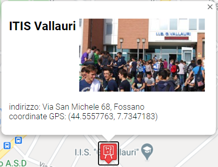

3. > **LEZIONE 3**
     3. > *Consegna GeoLocation - Ese 3 Mappe Dinamiche*
   
## Esercizio:
Viene caricata dinamicamente una mappa, alla quale vengono inseriti due marcatori, a loro volta, creati dinamicamente. Sul click di uno dei due marcatori si apre una info window:

  

